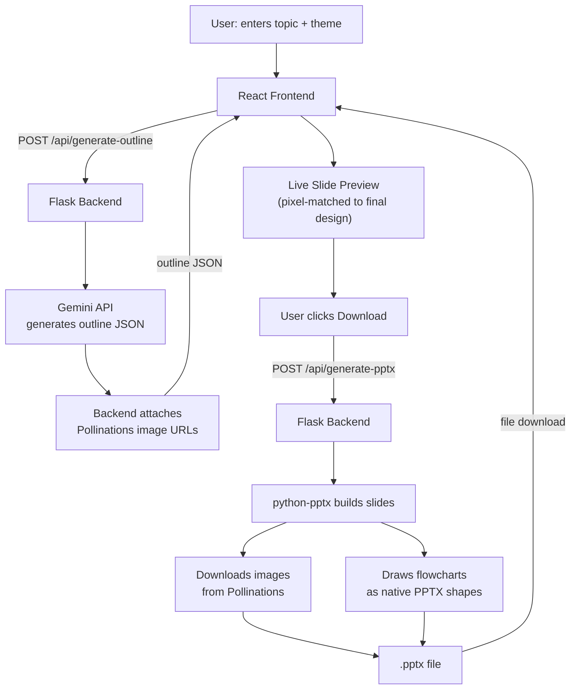
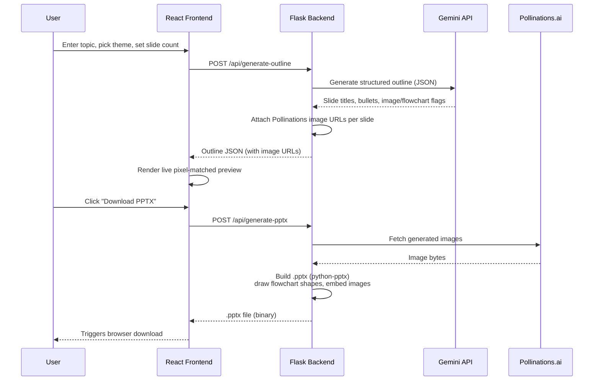

# ✨ AI Deck Generator

AI-powered presentation generator — give it a topic, pick a theme, and get back a fully designed, **real editable `.pptx` file** with AI-written content, AI-generated images, and auto-drawn flowcharts.

Built as a serverless full-stack app: a single-page React frontend calling a Python (Flask) backend that uses **Google Gemini** for content generation and **python-pptx** to build native, PowerPoint-editable slides.

---

## 🚀 Features

- **Topic → full outline** — Gemini generates a structured slide-by-slide outline (titles, bullets, and layout decisions) from just a topic
- **AI-decided visuals** — the model itself decides which slides need an image and which are process/pipeline content that needs a flowchart
- **Real AI-generated images** — via Pollinations.ai, matched to each theme's color palette
- **Native, editable flowcharts** — drawn as real PowerPoint shapes + connectors, not images, so they're editable after export
- **5 built-in themes** — Midnight, Sunrise, Forest, Ocean, Monochrome
- **Pixel-accurate live preview** — the in-browser preview mirrors the exact layout, colors, and images that ship in the final `.pptx`
- **One-click download** — real `.pptx` file, opens directly in PowerPoint / Google Slides / Keynote

---

## 🛠 Tech Stack

| Layer | Technology | Purpose |
|---|---|---|
| Frontend | **React 18** (CDN, no build step) | UI, theme picker, live slide preview |
| Frontend | **Babel Standalone** | In-browser JSX transpilation |
| Styling | **Vanilla CSS** + Google Fonts (Poppins) | Dark, gradient-accented UI |
| Backend | **Python 3 + Flask** | REST API server |
| AI content | **Google Gemini API** (`gemini-flash-latest`) | Outline generation, structured JSON output |
| AI images | **Pollinations.ai** (free, no key) | Theme-matched image generation |
| File generation | **python-pptx** | Builds real, editable `.pptx` files |
| Image processing | **Pillow (PIL)** | Fallback gradient/placeholder art |
| Deployment | **Vercel** | Serverless Python function + static hosting |

---

## 🏗 Architecture



---

## 🔄 Request Flow (Sequence Diagram)



---

## 📁 Project Structure

```
ppt-generator-vercel/
├── index.html          # React frontend (single file, CDN-based, no build step)
├── vercel.json          # Vercel routing config (/api/* → Python function)
├── README.md
└── api/
    ├── index.py          # Flask app — all backend logic
    └── requirements.txt  # Python dependencies
```

---

## ⚙️ Setup

### 1. Get a free Gemini API key
Go to [aistudio.google.com/apikey](https://aistudio.google.com/apikey) → sign in with Google → **Create API Key**. No credit card required — 1,500 requests/day free.

### 2. Run locally
```bash
cd api
pip install -r requirements.txt
export GEMINI_API_KEY=your-key-here
python index.py
```
Then open `index.html` directly in your browser (it auto-detects local mode and points to `http://localhost:5000`).

### 3. Deploy to Vercel
```bash
npm install -g vercel
vercel login
vercel env add GEMINI_API_KEY
vercel --prod
```
Or via the [Vercel dashboard](https://vercel.com): import the repo → set `GEMINI_API_KEY` in **Environment Variables** → Deploy.

---

## 🔌 API Endpoints

| Method | Endpoint | Description |
|---|---|---|
| `GET` | `/api/themes` | Returns available theme definitions |
| `POST` | `/api/generate-outline` | `{ topic, num_slides, audience, theme }` → returns outline JSON with image URLs |
| `POST` | `/api/generate-pptx` | `{ outline, theme }` → returns a downloadable `.pptx` binary |

---

## 🎨 Themes

| Theme | Primary | Secondary | Background |
|---|---|---|---|
| Midnight | `#6C5CE7` | `#00CEC9` | `#0F1220` |
| Sunrise | `#FF6B35` | `#F7C548` | `#FFF8F0` |
| Forest | `#1B6B3E` | `#8FBF6E` | `#F4F9F4` |
| Ocean | `#0B6E99` | `#37B6E8` | `#F0F7FF` |
| Monochrome | `#1A1A1A` | `#6E6E6E` | `#FFFFFF` |

---

## ⚠️ Known Limitations

- **Vercel Hobby plan** has a default 10s serverless function timeout — outline + image generation combined can occasionally exceed this on cold starts
- Pollinations.ai has no uptime SLA — if a request fails, the backend automatically falls back to generated gradient placeholder art so `.pptx` export never breaks
- Gemini free tier is rate-limited to 1,500 requests/day

---

## 📄 License

MIT — free to use, modify, and deploy.
